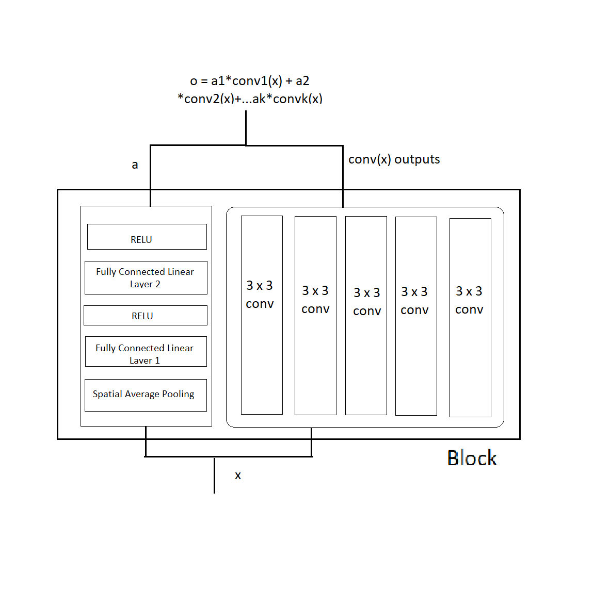

# CIFAR-10 Classification
This project aims to classify build a model to classify various images in the CIFAR-10 dataset.

# Dataset
CIFAR-10 is a publicly available dataset. To load the dataset ‘torchvision’ library is used. This dataset consists of 60000 32x32 colour images in 10 classes, with 6000 images per class.

# Model
The model consists of N number of Blocks connected to a classifier at the end. Each block has an MLP with K outputs and K number of convolution layers. The output of each lock is calculated by element-wise multiplication of the output of MLP and output of each convolution layer in a block. The structure of each Block is a shown below. 

The sequence of N number of block creates the Backbone of the network. The output of the last block of this backbone is input into the Classifier which is an MLP with number of final outputs as 10.

The final accuracy of the model on test data is 84.8 %

# Requirements
Python 3.x
pyTorch
NumPy
